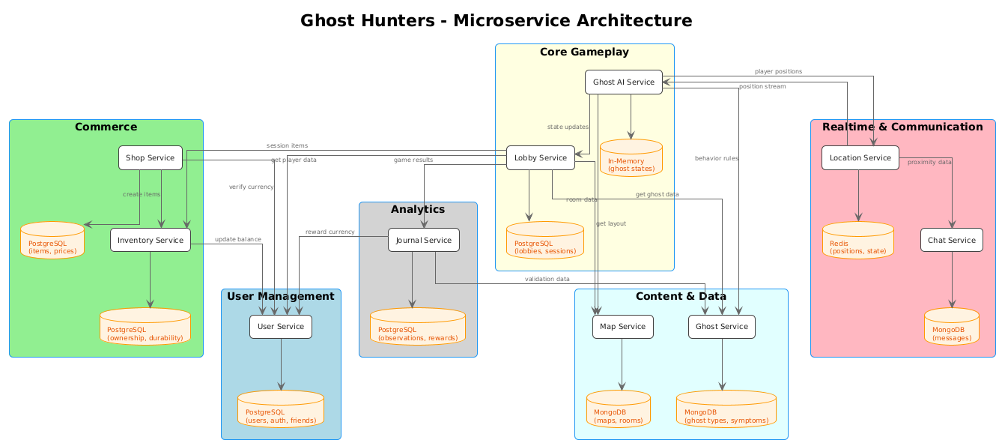

# Ghost Hunters – Microservices Architecture

## Overview

This backend powers a cooperative ghost-hunting game designed for large-scale concurrency.  
Instead of one giant monolithic server, the system is divided into **independent microservices**.  
Each microservice owns its domain logic and data, which improves scalability, fault isolation, and development speed.  

The following sections describe the **service boundaries**, their **responsibilities**, and how they interact during gameplay.

---

## Service Boundaries

### 1. User Management Service
Handles the lifecycle of players in the system. It provides secure access, tracks progress, and maintains social connections.

- **Responsibilities:** authentication, profile data, player level, in-game currency, friend relationships.  
- **Key Functions:** sign-up, login, token generation, profile updates, friend requests.  
- **Data Ownership:** users, credentials, friends, balances.  
- **Notes:** isolates all identity and social concerns; no other service manipulates its data directly.  

---

### 2. Ghost AI Service
Drives the supernatural entities that challenge players. Each ghost is simulated independently and adapts to the environment.

- **Responsibilities:** ghost behaviors, decision making, hauntings, targeting logic.  
- **Key Functions:** decide when to appear, chase or hide; interact with doors, lights, or items; scale difficulty by sanity level.  
- **Data Ownership:** AI states, behavior rules, ghost instance data.  
- **Notes:** runs each ghost in its own actor or thread to avoid shared-state issues.  

---

### 3. Shop Service
Implements the in-game economy. Players buy tools and gadgets to improve survival chances.

- **Responsibilities:** product catalog, item stats, pricing rules, purchase flow.  
- **Key Functions:** display shop items, handle dynamic pricing, record price history, validate purchases.  
- **Data Ownership:** items, prices, transaction logs.  
- **Notes:** functions as a standalone commerce unit.  

---

### 4. Evidence Journal Service
Players document paranormal activity and make deductions. This service rewards players for accurate ghost identification.

- **Responsibilities:** evidence tracking, ghost type guessing, scoring.  
- **Key Functions:** store observations, check guesses against ghost encyclopedia, award currency bonuses, provide post-match reports.  
- **Data Ownership:** evidence notes, guesses, scoring records.  
- **Notes:** operates independently with its own storage.  

---

### 5. Lobby Service
Coordinates live game sessions and keeps the state consistent across participants.

- **Responsibilities:** session creation, player states, difficulty settings, ghost/map assignment.  
- **Key Functions:** create lobby, add/remove players, assign items, track sanity and health, synchronize ghost activity.  
- **Data Ownership:** lobby metadata, player session data, current match settings.  
- **Notes:** central orchestrator for running matches.  

---

### 6. Map Service
Defines the playable environments.

- **Responsibilities:** house layouts, rooms, hiding spots, object placement.  
- **Key Functions:** generate maps, shuffle item positions, provide data to Lobby and Ghost AI.  
- **Data Ownership:** layouts, rooms, object locations.  
- **Notes:** produces procedural or static maps on demand.  

---

### 7. Ghost Encyclopedia Service
Provides canonical ghost information to other services.

- **Responsibilities:** ghost catalog, symptoms, hidden traits.  
- **Key Functions:** return ghost definitions, supply Type A (observable) and Type B (hidden) symptoms, expose behavior rules.  
- **Data Ownership:** ghost definitions, symptom lists.  
- **Notes:** read-only reference service.  

---

### 8. Location Service
Maintains real-time awareness of player positions and actions.

- **Responsibilities:** track movement, room occupancy, interaction logs, social context.  
- **Key Functions:** report position updates, log object interactions, detect group/alone status, flag visibility states.  
- **Data Ownership:** movement history, presence records, interaction events.  
- **Notes:** optimized for frequent updates, often cached in Redis.  

---

### 9. Inventory Service
Keeps track of item ownership across players and sessions.

- **Responsibilities:** manage owned items, track condition and usage, handle transfers.  
- **Key Functions:** assign purchased items, reduce durability on use, exchange items between players.  
- **Data Ownership:** ownership logs, durability values, usage history.  
- **Notes:** ensures accurate lifecycle tracking of equipment.  

---

### 10. Chat Service
Allows players to communicate with each other in immersive ways.

- **Responsibilities:** real-time chat, proximity filters, radio channels, haunting interference.  
- **Key Functions:** deliver messages, enforce spatial rules, manage radio channels, apply supernatural disruptions.  
- **Data Ownership:** messages, channel states, logs.  
- **Notes:** uses WebSockets for low-latency communication.  

---

## Inter-Service Communication

- **High frequency:** Lobby ↔ Ghost AI, Location ↔ Ghost AI, Location ↔ Chat.  
- **Medium frequency:** User ↔ Shop, Shop ↔ Inventory, Lobby ↔ Inventory.  
- **Low frequency:** Map ↔ Lobby, Ghost Encyclopedia ↔ Evidence Journal.  

The system mixes **REST APIs** (queries), **gRPC** (real-time sync), and **event streaming** (asynchronous updates).  

---

## Architecture Diagram

The following PlantUML diagram illustrates services and their main communication paths.





# Technologies and Communication Patterns

Our project adopts a **polyglot microservices strategy**, combining Java, TypeScript, and C#/.NET.  
Each language was selected for specific services where its **strengths match the business requirements**.  
This ensures high performance where needed, flexibility for real-time communication, and maintainability across domains.  

---

## Java — Robust Coordination Layer
**Services:** Lobby Service, Map Service  

We chose **Java with Spring Boot** for the services that act as the *coordination and orchestration backbone*.  
Java offers proven stability and mature frameworks for building **transactional, long-lived services** that must ensure consistency.  

- **Strengths:**  
  - Excellent for handling complex workflows and transactions.  
  - Large ecosystem for database integration, caching, and orchestration.  
  - Strong typing improves reliability for critical session data.  
  - Mature thread management and concurrency utilities.  

- **Business Case Fit:**  
  - The **Lobby Service** coordinates game sessions, which requires reliable state handling.  
  - The **Map Service** manages procedural and static maps, where deterministic processing is needed.  
  - Java is ideal for services that prioritize *consistency and stability* over ultra-low-latency.  

- **Communication Patterns:**  
  - REST APIs for lobby creation and map retrieval.  
  - gRPC for lobby-to-ghost AI synchronization.  
  - Event publishing for session updates (e.g., `lobby_created`, `map_assigned`).  

---

## TypeScript — Dynamic and Real-Time Services
**Services:** User Management, Ghost AI, Ghost Encyclopedia, Location  

We use **TypeScript with Node.js** for services that must handle **high concurrency and real-time data**.  
TypeScript provides the safety of strong typing while retaining JavaScript’s **event-driven, non-blocking I/O model**, which is perfect for fast-moving data.  

- **Strengths:**  
  - Async-first architecture fits streaming updates and real-time APIs.  
  - Native JSON support makes integration between services seamless.  
  - Lightweight and fast for prototypes and iteration.  
  - Rich ecosystem for WebSockets, gRPC, and message brokers.  

- **Business Case Fit:**  
  - The **User Management Service** benefits from JSON-native handling of profiles, tokens, and friend lists.  
  - The **Ghost AI Service** requires low-latency decision-making with frequent updates from Lobby and Location.  
  - The **Ghost Encyclopedia Service** serves as a flexible content API, well-suited to JSON-first structures.  
  - The **Location Service** streams player movements and interactions, requiring high-frequency event handling.  

- **Communication Patterns:**  
  - REST APIs for user profiles and ghost catalog queries.  
  - WebSockets for ghost AI state updates and location tracking.  
  - Kafka (or RabbitMQ) events for ghost actions and location changes.  

---

## C#/.NET — Performance-Critical and Stateful Services
**Services:** Shop, Journal, Inventory, Chat  

We selected **C# 12 with .NET 8** for services that are **performance-sensitive** and require **enterprise-grade reliability**.  
These services combine financial transactions, durability tracking, and real-time chat, where **strong typing and efficient async/await** models shine.  

- **Strengths:**  
  - High throughput with low memory overhead.  
  - Rich support for **financial and transactional logic** (ideal for Shop and Inventory).  
  - Built-in SignalR framework enables robust WebSocket communication (ideal for Chat).  
  - Excellent tooling and CI/CD integration for enterprise deployment.  

- **Business Case Fit:**  
  - The **Shop Service** demands transactional consistency and security for purchases.  
  - The **Journal Service** processes evidence and scoring, which benefits from .NET’s reliability.  
  - The **Inventory Service** requires accurate state management for item lifecycle and durability.  
  - The **Chat Service** handles real-time messaging with **SignalR**, ensuring scalable group and proximity channels.  

- **Communication Patterns:**  
  - REST APIs for purchases, inventory updates, and journal submissions.  
  - SignalR for bidirectional real-time chat.  
  - Event-driven updates for item transfers, scoring, and rewards.  

---

## Multi-Language Strategy — Trade-offs and Balance

- **Performance vs Flexibility:**  
  - Java handles stable, transactional coordination.  
  - TypeScript delivers rapid event-driven responsiveness.  
  - C# provides efficiency and reliability for performance-heavy services.  

- **Consistency vs Availability:**  
  - Financial data (Shop, Inventory) → strong consistency with .NET + SQL.  
  - Ghost AI and Location updates → prioritize availability and low latency with Node.js.  
  - Lobby orchestration → balance of both, using Java’s transaction safety.  

- **Cost vs Scalability:**  
  - Using three languages adds **team complexity** but ensures each domain runs in its *best environment*.  
  - Containerization (Docker + Kubernetes) abstracts language differences, making deployment uniform.  
  - Trade-off: polyglot increases DevOps workload, but improves scalability and fault isolation.  

---

## Communication Patterns Summary

| Pattern          | Usage Example                          | Technology        |
|------------------|----------------------------------------|------------------|
| **REST APIs**    | User registration, shop catalog        | Spring Boot, ASP.NET Core, Express |
| **gRPC**         | Lobby ↔ Ghost AI sync, Location ↔ AI   | Java & Node.js gRPC |
| **WebSockets**   | Player chat, location updates          | SignalR (.NET), Socket.IO (TS) |
| **Event Streaming** | Item purchased, player moved, ghost action | Kafka / RabbitMQ |

---

# Communication Contract & Data Management

## 1. Data Management Strategy

We follow the **Database-per-Service pattern**, where each microservice manages its own data.  
This ensures **loose coupling**: services interact only via APIs or events, never by directly accessing another service’s database.  

- **User Management (TypeScript, PostgreSQL):** users, profiles, friend lists, credentials.  
- **Ghost AI (TypeScript, Redis + PostgreSQL):** ghost states in Redis for real-time, logs in PostgreSQL.  
- **Ghost Encyclopedia (TypeScript, MongoDB):** ghost definitions, symptoms, traits.  
- **Location (TypeScript, Redis):** high-frequency movement and interaction events.  
- **Lobby (Java, PostgreSQL):** sessions, players, match parameters.  
- **Map (Java, PostgreSQL + MongoDB):** static layouts in SQL, procedural generation in MongoDB.  
- **Shop (C#/.NET, PostgreSQL):** items, prices, transactions.  
- **Inventory (C#/.NET, PostgreSQL):** ownership records, durability, usage.  
- **Journal (C#/.NET, PostgreSQL):** evidence notes, guesses, scoring.  
- **Chat (C#/.NET, Redis + PostgreSQL):** active chat rooms in Redis, message history in SQL.  

**Data Isolation Principle:**  
- Each service is the **single source of truth** for its data.  
- Other services obtain information by calling APIs or subscribing to events.  
- No shared database tables exist across services.  

---

## 2. Communication Between Services

Services interact through a mix of **REST APIs, gRPC, WebSockets, and Event Streaming** depending on the use case.

### High-Frequency Communication
- **Lobby ↔ Ghost AI:** Continuous synchronization of ghost state and player sanity.  
- **Location ↔ Ghost AI:** Player positions feed directly into ghost decision-making.  
- **Location ↔ Chat:** Proximity updates control message delivery.  

### Moderate-Frequency Communication
- **User Management ↔ Shop:** Validate player currency during purchases.  
- **Shop ↔ Inventory:** Transfer ownership and durability after purchases.  
- **Lobby ↔ Inventory:** Track which items are active in session.  
- **Journal ↔ Ghost Encyclopedia:** Verify ghost types against encyclopedia data.  

### Low-Frequency Communication
- **Map ↔ Lobby:** Provide layouts when a session starts.  
- **Ghost Encyclopedia ↔ Ghost AI:** Supply symptom/behavior definitions when AI initializes.  
- **Journal ↔ User Management:** Credit players with rewards after scoring.  

---

## 3. API Contracts (Examples)

### User Management Service
Handles authentication and player data.  
**Database:** PostgreSQL  

- `POST /users/register`  
  Request: `{ "username": "string", "email": "string", "password": "string" }`  
  Response: `{ "userId": "uuid", "createdAt": "timestamp" }`  

- `POST /users/login`  
  Request: `{ "email": "string", "password": "string" }`  
  Response: `{ "token": "jwt", "expiresIn": 3600 }`  

- `GET /users/{id}/friends`  
  Response: `{ "friends": [ { "id": "uuid", "username": "string" } ] }`  

## 4. Event Schemas (Examples)

- **ItemPurchased Event**  
```json
{
  "eventType": "ItemPurchased",
  "timestamp": "2025-09-11T10:00:00Z",
  "payload": {
    "userId": "uuid",
    "itemId": "uuid",
    "price": 500,
    "lobbyId": "lobby123"
  }
}
```

- **PlayerMoved Event**  
```json
{
  "eventType": "PlayerMoved",
  "timestamp": "2025-09-11T10:01:00Z",
  "payload": {
    "userId": "uuid",
    "lobbyId": "uuid",
    "roomId": "room42",
    "position": { "x": 2.5, "y": 0, "z": 7.1 }
  }
}
```

# 5. Data Flow Examples

## Buying an Item
1. Player requests purchase → Shop Service.
2. Shop checks balance with User Management.
3. If successful, Shop publishes `ItemPurchased`.
4. Inventory Service consumes event → records ownership.
5. Lobby Service consumes event → equips item in session.

## Player Movement
1. Player moves → Location Service records update.
2. Location publishes `PlayerMoved`.
3. Chat Service uses update to deliver proximity messages.
4. Ghost AI consumes update to adjust targeting.

## Ghost Interaction
1. Ghost AI decides to act → publishes `GhostAction`.
2. Lobby Service updates game state.
3. Inventory Service or Location Service reacts if objects or rooms are affected.
4. Journal Service logs evidence if symptoms are visible.


# Ghost Hunters - Service Endpoints Documentation

## Service Endpoints & API Contracts

This section enumerates all endpoints across all services and defines the data to be transferred, including format and response structure.

---

## User Management Service
Handles user profiles, authentication, and currency management.    
**Database:** PostgreSQL  

### Endpoints

#### POST /users/register
**Request**
```json
{
  "username": "string",
  "email": "string",
  "password": "string"
}
```
**Response**
```json
{
  "userId": "uuid",
  "username": "string",
  "currency": "int",
  "createdAt": "timestamp"
}
```

#### POST /users/login
**Request**
```json
{
  "email": "string",
  "password": "string"
}
```
**Response**
```json
{
  "token": "jwt",
  "userId": "uuid",
  "expiresIn": "int"
}
```

#### GET /users/{userId}/profile
**Response**
```json
{
  "userId": "uuid",
  "username": "string",
  "email": "string",
  "level": "int",
  "currency": "int"
}
```

#### POST /users/{userId}/currency/deduct
**Request**
```json
{
  "amount": "int",
  "transactionId": "uuid",
  "reason": "string"
}
```
**Response**
```json
{
  "success": "bool",
  "newBalance": "int"
}
```

#### GET /users/{userId}/friends
**Response**
```json
{
  "friends": [
    {
      "friendId": "uuid",
      "username": "string",
      "status": "online|offline|in-game"
    }
  ]
}
```

---

## Shop Service
Handles item catalog, pricing, and purchase transactions.  
**Database:** PostgreSQL  

### Endpoints

#### GET /shop/items
**Response**
```json
{
  "items": [
    {
      "itemId": "uuid",
      "name": "string",
      "description": "string",
      "price": "int",
      "durability": "int",
      "category": "equipment|consumable|tool"
    }
  ]
}
```

#### GET /shop/items/{itemId}
**Response**
```json
{
  "itemId": "uuid",
  "name": "string",
  "description": "string",
  "price": "int",
  "durability": "int",
  "category": "string"
}
```

#### POST /shop/purchase
**Request**
```json
{
  "userId": "uuid",
  "itemId": "uuid",
  "quantity": "int"
}
```
**Response**
```json
{
  "transactionId": "uuid",
  "success": "bool",
  "totalCost": "int",
  "message": "string"
}
```

#### GET /shop/items/{itemId}/price-history
**Response**
```json
{
  "itemId": "uuid",
  "priceHistory": [
    {
      "price": "int",
      "effectiveDate": "timestamp",
      "reason": "string"
    }
  ]
}
```

---

## Inventory Service
Tracks item ownership, durability, and usage.  
**Database:** PostgreSQL  

### Endpoints

#### GET /inventory/users/{userId}
**Response**
```json
{
  "items": [
    {
      "inventoryId": "uuid",
      "itemId": "uuid",
      "name": "string",
      "durability": "float",
      "status": "active|broken"
    }
  ]
}
```

#### POST /inventory/items/{inventoryId}/use
**Request**
```json
{
  "userId": "uuid",
  "usageType": "ghost_interaction|player_use|death_penalty"
}
```
**Response**
```json
{
  "success": "bool",
  "newDurability": "float",
  "itemDestroyed": "bool"
}
```

#### GET /inventory/users/{userId}/purchase-history
**Response**
```json
{
  "purchases": [
    {
      "itemId": "uuid",
      "itemName": "string",
      "price": "int",
      "purchaseDate": "timestamp"
    }
  ]
}
```

---

## Lobby Service
Manages game sessions, player states, and lobby coordination.  
**Database:** PostgreSQL, Redis (real-time)  

### Endpoints

#### POST /lobbies/create
**Request**
```json
{
  "hostId": "uuid",
  "mapId": "uuid",
  "difficulty": "easy|medium|hard|nightmare",
  "maxPlayers": "int"
}
```
**Response**
```json
{
  "lobbyId": "uuid",
  "joinCode": "string",
  "status": "waiting"
}
```

#### POST /lobbies/{lobbyId}/join
**Request**
```json
{
  "userId": "uuid",
  "selectedItems": ["uuid"]
}
```
**Response**
```json
{
  "success": "bool",
  "playerCount": "int",
  "sanityLevel": "int"
}
```

#### GET /lobbies/{lobbyId}/state
**Response**
```json
{
  "lobbyId": "uuid",
  "status": "waiting|active|completed",
  "players": [
    {
      "userId": "uuid",
      "username": "string",
      "sanityLevel": "int",
      "isAlive": "bool"
    }
  ],
  "ghostType": "string",
  "timeRemaining": "int"
}
```

#### POST /lobbies/{lobbyId}/start
**Request**
```json
{
  "hostId": "uuid"
}
```
**Response**
```json
{
  "success": "bool",
  "gameId": "uuid",
  "message": "string"
}
```

---

## Ghost AI Service
Handles ghost behavior, decision making, and supernatural events.  
**Database:** Redis (real-time), PostgreSQL (logs)  

### gRPC Service Definition

```protobuf
service GhostAI {
  rpc StartGhostForLobby (LobbyStartRequest) returns (GhostStartResponse);
  rpc UpdatePlayerPositions (LocationUpdate) returns (Ack);
  rpc GetGhostState (GhostStateRequest) returns (GhostState);
  rpc TriggerGhostEvent (GhostEventRequest) returns (GhostEventResponse);
}

message LobbyStartRequest {
  string lobby_id = 1;
  string ghost_type = 2;
  repeated string player_ids = 3;
}

message LocationUpdate {
  string user_id = 1;
  float x = 2;
  float y = 3;
  float z = 4;
}

message GhostState {
  string ghost_id = 1;
  string behavior = 2;
  float aggression_level = 3;
  string current_room = 4;
}
```

### REST Endpoints

#### GET /ghost-ai/lobbies/{lobbyId}/state
**Response**
```json
{
  "ghostId": "uuid",
  "behavior": "hiding|showing|haunting",
  "aggressionLevel": "float",
  "currentRoom": "string"
}
```

---

## Map Service
Handles map layouts, room configurations, and environmental data.  
**Database:** MongoDB  

### Endpoints

#### GET /maps
**Response**
```json
{
  "maps": [
    {
      "mapId": "uuid",
      "name": "string",
      "difficulty": "string",
      "roomCount": "int"
    }
  ]
}
```

#### GET /maps/{mapId}
**Response**
```json
{
  "mapId": "uuid",
  "name": "string",
  "layout": {
    "rooms": [
      {
        "roomId": "uuid",
        "name": "string",
        "coordinates": {"x": "float", "y": "float"},
        "connectedRooms": ["uuid"]
      }
    ]
  }
}
```

#### POST /maps (Admin)
**Request**
```json
{
  "name": "string",
  "difficulty": "string",
  "layout": "object"
}
```
**Response**
```json
{
  "mapId": "uuid",
  "success": "bool"
}
```

---

## Ghost Service
Stores ghost encyclopedia, symptoms, and behavioral definitions.  
**Database:** MongoDB  

### Endpoints

#### GET /ghosts/types
**Response**
```json
{
  "ghostTypes": [
    {
      "ghostId": "uuid",
      "name": "string",
      "typeASymptoms": ["string"],
      "typeBSymptoms": ["string"],
      "huntThreshold": "int"
    }
  ]
}
```

#### GET /ghosts/types/{ghostId}
**Response**
```json
{
  "ghostId": "uuid",
  "name": "string",
  "description": "string",
  "typeASymptoms": ["string"],
  "typeBSymptoms": ["string"],
  "huntBehavior": "string"
}
```

#### POST /ghosts/validate-guess
**Request**
```json
{
  "actualGhostId": "uuid",
  "guessedGhostId": "uuid",
  "observedSymptoms": ["string"]
}
```
**Response**
```json
{
  "correct": "bool",
  "accuracy": "float",
  "correctSymptoms": ["string"]
}
```

---

## Location Service
Tracks real-time player positions and room occupancy.  
**Database:** Redis  

### WebSocket Events

**position_update**
```json
{
  "userId": "uuid",
  "position": {"x": "float", "y": "float", "z": "float"},
  "roomId": "uuid",
  "isHiding": "bool",
  "timestamp": "timestamp"
}
```

**proximity_update**
```json
{
  "nearbyPlayers": [
    {
      "userId": "uuid",
      "distance": "float",
      "sameRoom": "bool"
    }
  ]
}
```

### REST Endpoints

#### GET /locations/lobbies/{lobbyId}/players
**Response**
```json
{
  "players": [
    {
      "userId": "uuid",
      "position": {"x": "float", "y": "float", "z": "float"},
      "roomId": "uuid",
      "isAlone": "bool",
      "lastUpdate": "timestamp"
    }
  ]
}
```

---

## Journal Service
Manages player observations, ghost identification, and reward calculation.  
**Database:** PostgreSQL  

### Endpoints

#### POST /journal/observations
**Request**
```json
{
  "userId": "uuid",
  "lobbyId": "uuid",
  "observation": {
    "symptom": "string",
    "description": "string",
    "confidence": "low|medium|high"
  }
}
```
**Response**
```json
{
  "observationId": "uuid",
  "recorded": "bool"
}
```

#### POST /journal/guess
**Request**
```json
{
  "userId": "uuid",
  "lobbyId": "uuid",
  "guessedGhostType": "string"
}
```
**Response**
```json
{
  "guessId": "uuid",
  "submitted": "bool"
}
```

#### GET /journal/lobbies/{lobbyId}/evaluation
**Response**
```json
{
  "actualGhostType": "string",
  "playerEvaluations": [
    {
      "userId": "uuid",
      "accuracy": "float",
      "reward": "int",
      "correctSymptoms": "int"
    }
  ]
}
```

---

## Chat Service
Handles real-time communication with proximity and radio systems. 
**Database:** MongoDB  

### WebSocket Events

**join_lobby**
```json
{
  "userId": "uuid",
  "lobbyId": "uuid",
  "username": "string"
}
```

**send_message**
```json
{
  "from": "uuid",
  "message": "string",
  "messageType": "text|radio",
  "roomId": "uuid"
}
```

**receive_message**
```json
{
  "from": "uuid",
  "fromUsername": "string",
  "message": "string",
  "canHear": "bool",
  "timestamp": "timestamp"
}
```

**radio_transmission**
```json
{
  "from": "uuid",
  "message": "string",
  "radioRange": "local|global"
}
```

### REST Endpoints

#### GET /chat/lobbies/{lobbyId}/messages
**Response**
```json
{
  "messages": [
    {
      "messageId": "uuid",
      "fromUsername": "string",
      "content": "string",
      "messageType": "text|radio",
      "timestamp": "timestamp"
    }
  ]
}
```

## GitHub Workflow Setup

Our repository follows a structured GitHub workflow to ensure quality, collaboration, and traceability.

### Branching Strategy
- **main**: Stable production-ready branch.
- **development**: Integration branch for new features and fixes before release.
- **feature/***: Used for new features (e.g., `feature/chat-service`).
- **bugfix/***: Used for bug fixes (e.g., `bugfix/login-error`).
- **hotfix/***: Used for urgent fixes in production (e.g., `hotfix/payment-bug`).

### Merging Strategy
- We use **Squash and Merge** for a clean, linear commit history.
- Direct pushes to `main` or `development` are prohibited; all changes must go through a PR.
- Merge only after the required number of approvals (default: **2 reviewers**) and successful CI checks.

### Pull Request Guidelines
- Each PR must have a clear title and description explaining the changes.
- Ensure all tests pass before requesting a review.
- PRs should be small and focused to simplify review.

### Test Coverage
- Automated tests are run on every PR using GitHub Actions.
- Include unit and integration tests for new features or bug fixes.

### Versioning
- We follow **Semantic Versioning (SemVer)**: `MAJOR.MINOR.PATCH`.
  - **MAJOR**: Incompatible API changes.
  - **MINOR**: New features, backwards-compatible.
  - **PATCH**: Bug fixes, small improvements.
- Each release is tagged in GitHub (e.g., `v1.2.0`) and documented in the changelog.


